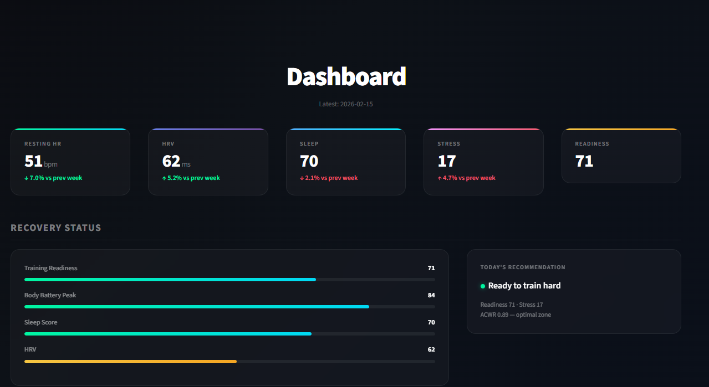
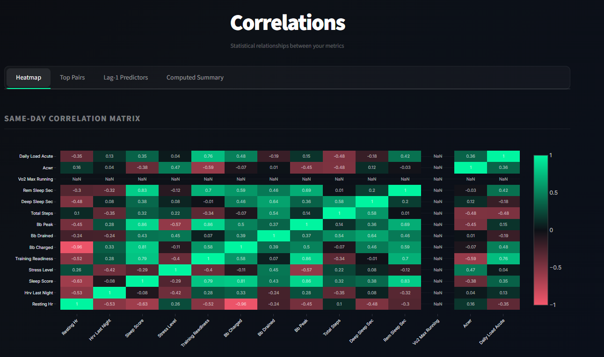
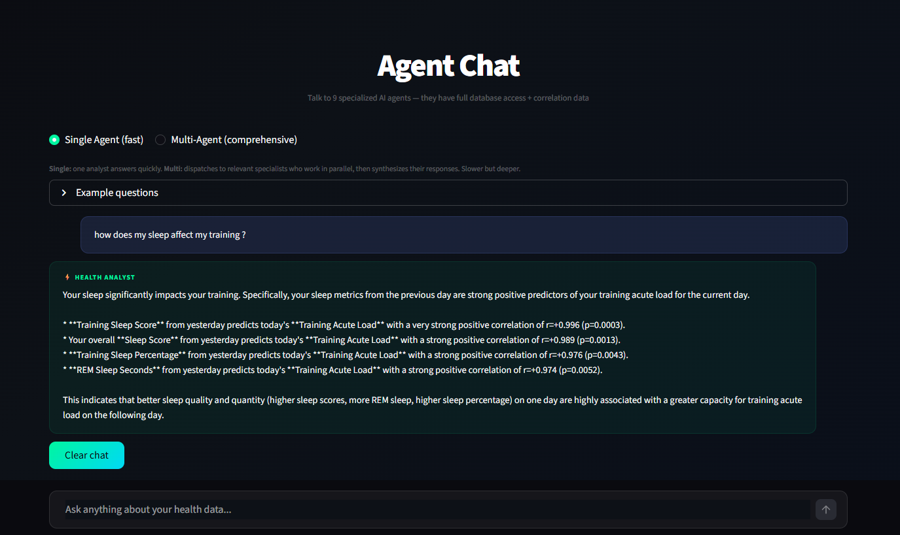

# Garmin Health Intelligence 🏃‍♂️📊

A personal data analytics platform that unlocks actionable insights from wearable health metrics. Combines a robust data pipeline with a team of specialized AI agents backed by a custom-built statistical engine.

## 🎯 Project Goal

Garmin Connect provides excellent data tracking, but I wanted more depth. I wanted to understand the *relationships* between my metrics, not just see the numbers.

**Garmin Health Intelligence** answers "Why?":
* Why is my recovery low today despite sleeping 8 hours?
* How does my daily stress actually impact my training readiness?
* What is the single most impactful factor affecting my sleep quality?

Instead of relying on generic algorithms, this system uses custom-built mathematics to analyze *my* specific data patterns and provide personalized feedback.

## 📸 Dashboard Preview


*Real-time metrics, recovery status, and 7-day trends at a glance.*


*Discovering hidden relationships between sleep, HRV, stress, and activity.*


*Chatting with the AI agents to get data-backed answers to health questions.*

## 🏗️ System Architecture

The project operates as a fully automated weekly pipeline (runs every Sunday via GitHub Actions):

```
┌──────────────────────────────────────────────────────────────────────┐
│                    WEEKLY PIPELINE (GitHub Actions)                  │
├──────────────────────────────────────────────────────────────────────┤
│                                                                      │
│  Step 1: FETCH         Garmin Connect API → PostgreSQL (upserts)     │
│  Step 2: CLASSIFY      Training intensity & body-part split          │
│  Step 3: COMPUTE       Correlation Engine (13 statistical layers)    │
│  Step 4: ANALYZE       5 AI Agents interpret the math (CrewAI)       │
│  Step 5: SAVE          Insights → DB + Recommendations → Memory      │
│  Step 6: EMAIL         Weekly recommendations → your inbox 📧        │
│                                                                      │
└──────────────────────────────────────────────────────────────────────┘
```

### Core Components

| Component | File | Role |
|---|---|---|
| **Data Fetcher** | `src/enhanced_fetcher.py` | Pulls data from Garmin Connect via the `garth` API |
| **Statistical Engine** | `src/correlation_engine.py` (1,640 lines) | Deterministic math — Pearson, AR(1), Markov chains, anomaly detection |
| **AI Agents** | `src/enhanced_agents.py` (1,038 lines) | 5 constrained specialist agents that interpret the math |
| **Dashboard** | `src/dashboard.py` | Streamlit UI for exploring data interactively |
| **Pipeline** | `src/weekly_sync.py` | Orchestrates the weekly pipeline end-to-end |
| **Email Reminder** | `src/send_export_reminder.py` | Sends a weekly reminder to export Garmin data |
| **Email** | `src/email_notifier.py` | Sends HTML email with weekly recommendations |
| **Schema** | `src/enhanced_schema.py` | Database table definitions |

> [!TIP]
> **For a deep dive into the math and agent design, see [Why the Math Is Mathing & Why Agents Aren't Hallucinating](why_the_math_mathing_and_why_agents_arent_hallucinating.md)** — a 500+ line technical document explaining every formula, every statistical test, and every anti-hallucination guardrail.

### Weekly Reminder Setup
To get a weekly email reminding you to click "Export":
1. Add a job to Heroku Scheduler.
2. Command: `python src/send_export_reminder.py`
3. Frequency: Weekly (e.g., Sunday 08:00 AM).

## 💾 Database Structure

PostgreSQL tables designed for time-series health analysis:

| Table | Purpose |
|---|---|
| `daily_metrics` | Core table — RHR, HRV, Sleep Score, Body Battery, Stress, Readiness, VO2Max, etc. |
| `activities` | Every workout — type, duration, intensity, physiological load |
| `wellness_log` | Self-reported data — energy, soreness, caffeine, nutrition |
| `matrix_summaries` | Pre-computed statistical context for the AI agents |
| `agent_recommendations` | Parsed recommendations with target metrics & expected directions |
| `weekly_summaries` | Aggregated weekly stats + full AI insight text |

## 🤖 The AI Agent Team

Instead of a single generic LLM, the system employs **5 specialized AI agents**, each with a distinct role. They work sequentially, with each agent's output feeding the next:

| # | Agent | Role |
|---|---|---|
| 1 | **Statistical Interpreter** | Translates raw correlation matrices into plain English findings. No SQL access — works purely on pre-computed math. |
| 2 | **Health Pattern Analyst** | Detects day-by-day patterns, flags outliers and data quality issues. Has SQL access to verify claims. |
| 3 | **Performance & Recovery** | Analyzes ACWR trajectory, training load, recovery capacity (bounce-back speed). Has SQL access. |
| 4 | **Sleep & Lifestyle** | Deep-dives into sleep architecture and connects lifestyle factors to biometric outcomes. Has SQL access. |
| 5 | **Synthesizer** | The "Team Lead" — resolves conflicts between agents, checks against past recommendations (long-term memory), and produces the final actionable insights. |

> [!IMPORTANT]
> **The agents never compute statistics.** All math is performed by the deterministic `CorrelationEngine` *before* agents are invoked. Agents only interpret pre-validated results. See the [full technical explanation](why_the_math_mathing_and_why_agents_arent_hallucinating.md).

## 📧 Weekly Email Notifications

After each automated sync, the system sends an HTML-formatted email with:
- 🎯 **Recommendation cards** extracted from the Synthesizer's output
- 📊 **Synthesizer analysis** summary (bottleneck + quick wins)
- Color-coded badges (IMPROVE / DECLINE / STABLE) for each recommendation

**Setup:**
1. Generate a [Gmail App Password](https://myaccount.google.com/apppasswords)
2. Add to GitHub Secrets: `EMAIL_APP_PASSWORD` and `EMAIL_RECIPIENT`
3. The pipeline sends the email automatically after each weekly sync

The email degrades gracefully — if credentials aren't set, the pipeline runs normally without sending email.

## 🚀 Key Features

* **Fully Automated:** Runs weekly via GitHub Actions — zero manual intervention
* **Weekly Email Intelligence:** Actionable recommendations delivered to your inbox every Sunday
* **Interactive Dashboard:** Explore trends, deep-dive into specific days, and visualize correlations
* **Natural Language Chat:** Ask questions like *"How did my marathon training affect my sleep this month?"* and get answers grounded in your actual database
* **Daily Input Form:** Log subjective data (energy, soreness, nutrition) to enrich analysis
* **Long-Term Memory:** The Synthesizer tracks past recommendations and adjusts advice based on outcomes
* **Privacy Focused:** Personal data stays in your private database; only statistical summaries go to the LLM
* **Bulk Import Automation:** automated flow from Garmin Data Export -> ZIP Download -> DB Ingest -> Production Merge.

## 🛠️ Tech Stack

| Technology | Purpose |
|---|---|
| **Python 3.12** | Core language |
| **PostgreSQL** | Time-series health database (Heroku) |
| **Streamlit** | Dashboard UI |
| **CrewAI** | Agent orchestration framework |
| **Google Gemini 2.5 Flash** | LLM for agent reasoning |
| **Plotly** | Interactive visualizations |
| **GitHub Actions** | Automated weekly pipeline |
| **Gmail SMTP** | Email notifications |

## 📂 Project Structure

```
garmin_project/
├── src/
│   ├── correlation_engine.py   # Statistical engine (13 analysis layers)
│   ├── enhanced_agents.py      # 5 AI agents + tools + memory
│   ├── enhanced_fetcher.py     # Garmin API data fetcher
│   ├── dashboard.py            # Streamlit dashboard
│   ├── weekly_sync.py          # Pipeline orchestrator
│   ├── email_notifier.py       # Weekly email sender
│   ├── enhanced_schema.py      # DB schema definitions
│   ├── visualizations.py       # Chart helpers
│   └── garmin_merge.py         # FIT file bulk import
├── .github/workflows/
│   └── weekly_sync.yml         # GitHub Actions cron job
├── why_the_math_mathing_and_why_agents_arent_hallucinating.md
├── requirements.txt
└── .env                        # Credentials (not committed)
```

---

*This project is for educational and personal use, exploring the intersection of Data Engineering and GenAI.*
